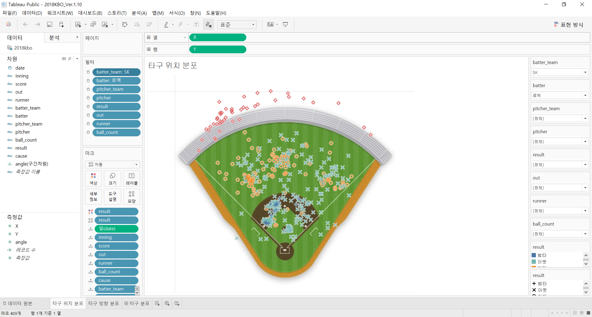
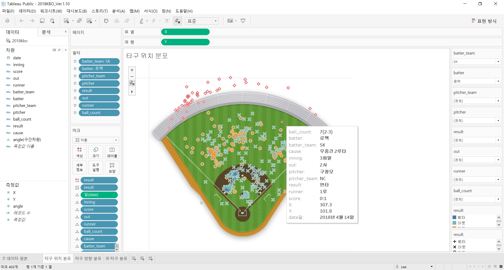

### 
2018KBO Visualization of Batting Result Data

# **
2018KBO 타구 결과 데이터 시각화
**

 

프로젝트 결과를 한 눈에 파악할 수 있도록 만든 대시보드.
[링크](https://public.tableau.com/views/2018KBO_Ver_1_10/sheet2?:display_count=y&:origin=viz_share_link)

## **개요**
2018시즌 KBO 타자들의 타구 정보를 수집한 후 Tableau를 이용해 시각화.

---

## **진행**

### **1. 데이터수집**

- 방법 : Python Selenium을 이용한 크롤링
- 장소 : Naver Sports, Statiz
- 수집 데이터 :
    - 경기 일자
    - 이닝
    - 타자 소속팀
    - 타자 이름
    - 상대팀
    - 상대 투수
    - 타구 결과
    - 타구 상세
    - 타구 위치
    - 볼 카운트
    - 당시 스코어
    - 아웃 카운트
    - 주자 여부
    ---

### **2. 시각화**

Tableau Public을 이용해 시각화를 진행.

**[타구 위치 분포]**

수집한 위치 데이터를 그라운드 모양의 이미지 위에 표시.\
타구 위치 좌표의 경우 Naver Sports에서 그라운드 이미지 위에 표시한 점의 css 정보를 참조함.\
필터를 이용해 특정 상황의 정보를 추출 가능.

타구 결과에 따라 다른 색깔로 표시.

- 빨간색 : 홈런
- 노란색 : 안타
- 연두색 : 아웃
- 파란색 : 범타(실책 등)

 

**[타구 방향 분포]**

수집한 타구 위치 좌표 정보를 기반으로 타구 방향 데이터를 계산 후 시각화.\
필터를 이용해 특정 상황의 정보를 추출 가능.

 

**[대시 보드]**

타구 위치 분포와 타구 방향 분포 그래프를 이용해 한 눈에 볼 수 있도록 대시보드 제작.\
특정 상황의 정보를 쉽게 파악할 수 있도록 필터를 배치.

---

## **결과**

다음과 같은 [대시보드](https://public.tableau.com/views/2018KBO_Ver_1_10/sheet2?:display_count=y&:origin=viz_share_link)를 통해 2018시즌 KBO 타자들의 타구 정보를 파악할 수 있게 함.

